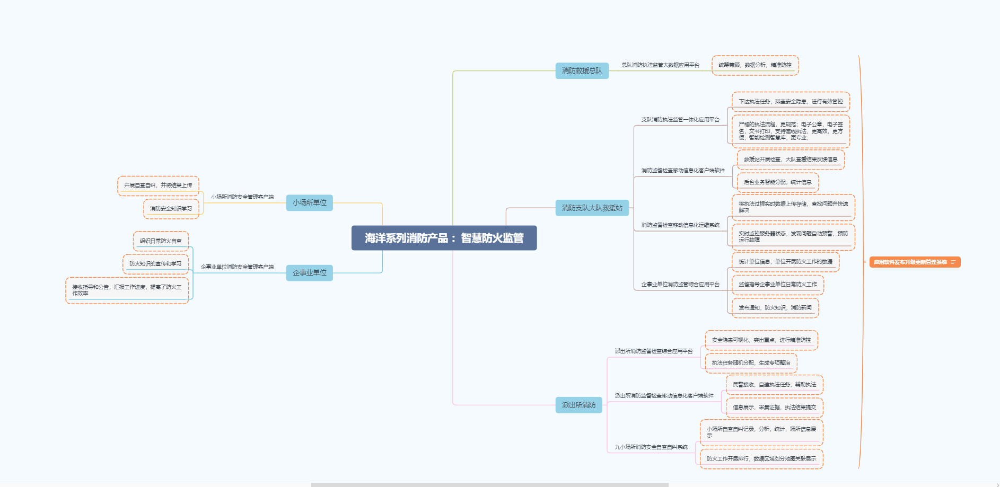

#### 消防执法监管产品 - 2020-12-22

思维导图

### 业务实现

#### 机构组织结构

应急管理部（部级）->消防救援局（副部）->消防总队（省）->消防支队（市）->消防大队（区县）->消防救援站（ 乡镇）

纸质化->信息化->数字化

B（Business）端  企业用户商家

C（Consumer）端  个人用户

G（Government）端  政府、事业单位群体